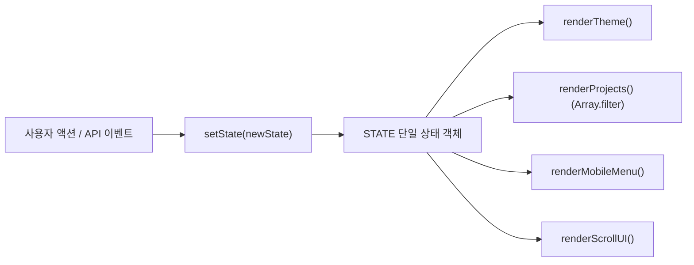

# 나를 소개하는 웹페이지 처음부터 만들기

> **[나를 소개하는 웹페이지 처음부터 만들기] - 순수 HTML/CSS/JavaScript로 구현한 반응형 포트폴리오 웹사이트 (중앙 STATE 아키텍처, Array.filter 다이나믹 필터링, GitHub API 연동 및 다크 모드 지원)**

---

## 📖 과제 소개

본 프로젝트는 외부 UI 프레임워크(React, Vue, jQuery, Bootstrap, Tailwind CSS 등)를 일체 사용하지 않고, 웹 표준 기술인 **순수 HTML5, CSS3, Vanilla JavaScript(ES6+)만으로 완성한 반응형 포트폴리오 웹사이트입니다.**

단순 정적 마크업을 넘어 모던 프론트엔드의 핵심 원리인 **"중앙 집중 상태(STATE) → 상태 갱신(setState) → 순수 함수형 UI 렌더링(render)"의 단방향 데이터 흐름 아키텍처를 순수 자바스크립트로 구축했습니다.** 또한 GitHub REST API를 연동하여 4대 비동기 상태(로딩, 성공, 에러/타임아웃/레이트 리밋, 빈 데이터)를 견고하게 핸들링하며, `Array.filter` 메서드를 활용한 실시간 언어별 프로젝트 필터링 시스템을 지원합니다.

---

## 🎯 학습 목표

- **시맨틱 마크업과 웹 접근성(a11y)**: `div` 남발을 지양하고 시맨틱 태그(`<header>`, `<nav>`, `<main>`, `<section>`, `<article>`, `<footer>`) 및 WAI-ARIA 속성을 적용하여 스크린 리더와 키보드 접근성(`Esc` 메뉴 닫기, 폼 자동 포커스)을 보장합니다.
- **CSS 변수와 반응형 레이아웃**: `:root` 디자인 토큰 시스템을 구축하고, 1차원 배치는 Flexbox, 2차원 카드 배치는 Grid(`repeat(auto-fit, minmax(...))`)를 적재적소에 활용하여 모바일 퍼스트 반응형 레이아웃을 완성합니다.
- **중앙 상태 관리(STATE 패턴)**: 분산된 전역 변수를 단일 `STATE` 객체로 통합하고, `setState()`를 통해서만 상태 변경을 허용하여 예측 가능한 UI 동기화 체계를 설계합니다.
- **함수형 배열 조작(`Array.filter`, `Array.map`)**: 고차 함수를 체이닝하여 실시간 카테고리 필터링 및 동적 템플릿 리터럴 렌더링을 구현합니다.
- **비동기 통신 안정성(`fetch`, `AbortController`)**: `async/await` 예외 처리와 함께 8초 네트워크 타임아웃을 제어하여 무한 대기 현상을 원천 방지합니다.
- **실시간 폼 유효성 검증 UX**: 정규식 기반 검증, `blur`/`input` 분리 스마트 검증, 접근성을 고려한 자동 포커스 및 즉각적 에러 해제를 설계합니다.

---

## 🏗️ 아키텍처: 중앙 집중형 STATE 패턴

컴포넌트 기반 프레임워크의 상태 관리 원리를 Vanilla JS로 순수하게 구현했습니다.



### 상태 객체 (`STATE`) 구조
```javascript
const STATE = {
  theme: 'light',           // 'light' | 'dark'
  filter: 'all',            // 'all' | 'JavaScript' | 'Java' | 'Python' | 'HTML' | 'CSS'
  repos: [],                // GitHub API 또는 샘플 저장소 배열
  projectStatus: 'idle',    // 'idle' | 'loading' | 'success' | 'error' | 'empty'
  errorMessage: '',         // 에러 발생 시 안내 문구
  isRateLimit: false,       // 403 호출 제한 여부
  mobileMenuOpen: false,    // 모바일 햄버거 메뉴 열림 상태
  scrollY: 0                // 현재 스크롤 위치 (px)
};
```

---

## 🌟 주요 기능

1. **6대 필수 섹션 구성 및 내러티브 시점 일치화**:
   - `Hero`: 직무(AI & 백엔드 엔지니어), 엔지니어링 테크 그리드 배경 & 앰비언트 아우라, 데스크톱 프로필 터미널 카드(`cat engineer_profile.json`), CTA 앵커 버튼
   - `About`: 개발 가치관(사람을 위한 개발자) → 실무 경험(MIS 유지보수 및 차세대 개발 1년) → 현재 도전(Codyssey AI 과정 동료학습 & 상호 평가) → 취미(배드민턴)의 자연스러운 시간순 서사 배치
   - `Skills`: Backend, Database, Web Basics, Tools 4개 그룹별 기술 스택 목록 및 정밀 그리드 정렬
   - `Projects`: GitHub REST API 연동 및 `Array.filter` 기반 언어별 카테고리 필터링 바
   - `Contact`: 직접 연락 채널 정보 카드(GitHub, Email, Location, Status)와 문의 폼의 좌우 시각적 밸런스 및 실시간 유효성 검사
   - `Footer`: 저작권 표기(&copy; 2026 MyeongHwan Cho) 및 GitHub/Email 소셜 링크

2. **Array.filter 기반 실시간 프로젝트 필터링 (#12 요구사항 충족)**:
   - 프로젝트 상단에 전체, JavaScript, Java, Python, HTML, CSS 카테고리 필터 버튼 제공
   - 선택된 필터에 따라 `STATE.repos.filter(...)`를 실행하여 조건에 맞는 저장소만 즉시 렌더링
   - 일치하는 프로젝트가 없을 경우 친화적인 빈 결과 UI(`filter-empty-state`) 및 [전체 보기] 리셋 버튼 제공

3. **반응형 인터랙션 & 네비게이션 최적화**:
   - 상단 최우측 다크 모드 토글 버튼 재배치로 데스크톱/모바일 UI 균형 확보
   - 모바일 네비게이션 햄버거 메뉴 토글 및 키보드 `Esc` 누름 시 메뉴 닫기 지원 (접근성)
   - 앵커 링크 부드러운 스크롤 이동 (`scroll-behavior: smooth`)
   - 스크롤 60px 이상 시 헤더 블러 및 배경색 스타일 전환
   - 스크롤 300px 이상 시 우측 하단 스크롤탑 버튼 노출 및 최상단 이동
   - 페이지 최하단 도달 시 마지막 Contact 네비게이션 메뉴 자동 활성화 감지 로직
   - `IntersectionObserver`를 활용한 카드 및 섹션 스크롤 진입 페이드인 애니메이션

4. **테마 영속화 및 OS 실시간 동기화 (다크 모드)**:
   - 다크 모드 토글 버튼 및 `[data-theme="dark"]` CSS 변수 오버라이드
   - `localStorage`를 통한 사용자 테마 설정 영구 보존 및 비정상 값에 대한 기본값 자동 폴백
   - `window.matchMedia('(prefers-color-scheme: dark)')` 이벤트 리스너를 통한 OS 테마 실시간 감지/반영

5. **GitHub API 4대 상태 처리 & 비동기 안정성**:
   - `AbortController` 기반 8초 네트워크 타임아웃 방어 로직 내장
   - 로딩 상태: 원형 스피너 및 로딩 텍스트 노출
   - 성공 상태: `Array.filter` + `Array.map` 조합을 통한 동적 카드 렌더링
   - 에러 상태: 403 Rate Limit 및 타임아웃 대응 안내, [다시 시도], [샘플 프로젝트 보기] 지원
   - 빈 데이터 상태: 안내 문구 및 [샘플 프로젝트 불러오기] 지원

6. **다크모드 맞춤형 Contact 폼 실시간 유효성 검사**:
   - 다크모드 전용 에러/성공 디자인 토큰(`--error-bg: rgba(239, 68, 68, 0.14)`, `--error-color: #f87171`) 완비로 글씨 시인성 100% 보장
   - `blur` 시 엄격 검증, `input` 시 실시간 즉시 에러 해제 스마트 검증
   - 제출 오류 시 첫 번째 실패 필드로 자동 포커스 이동 (접근성 극대화)

---

## 🎨 레이아웃 설계 전략 (Flexbox vs Grid)

| 영역 | 채택 레이아웃 | 채택 이유 |
| :--- | :---: | :--- |
| **Header / Nav** | **Flexbox** | 로고와 네비게이션 메뉴, 테마 토글 버튼 간의 1차원 수평 정렬 및 공간 균등 배분(`justify-content: space-between`)에 최적 |
| **Hero 섹션** | **Flexbox** | 텍스트 영역과 터미널 카드 간의 1차원 반응형 배치(모바일: 세로, 데스크톱: 가로) 전환 용이 |
| **About 섹션** | **Grid & Flexbox** | 프로필 사진 열과 4대 소개 카드 열의 비대칭 비율 분할(1:2)에 Grid 채택, 카드 내부는 Flexbox로 정렬 |
| **Skills 섹션** | **Grid** | 4개의 스킬 그룹 카드가 뷰포트 크기에 따라 `repeat(auto-fit, minmax(240px, 1fr))`로 유연하게 줄바꿈되며 균일한 높이 유지 |
| **Projects 섹션** | **Grid** | 저장소 카드 목록이 `repeat(auto-fit, minmax(320px, 1fr))`로 배치되어 화면 너비에 맞춰 자연스럽게 열 개수가 자동 조절됨 |
| **Contact 섹션** | **Grid** | 연락처 안내 카드와 입력 폼의 1:1 수평 분할 및 모바일 세로 전환에 최적화 |

---

## 🛠️ 사용 기술 및 제약 사항 준수

| 구분 | 적용 기술 및 도구 | 제약 사항 준수 여부 |
| :--- | :--- | :---: |
| **Markup** | HTML5 Semantic Elements, WAI-ARIA, Google Fonts, Font Awesome | **준수** (외부 UI 프레임워크 미사용) |
| **Styling** | CSS3 (:root 변수, Flexbox, Grid, Media Queries, Transition) | **준수** (인라인 스타일 `style="..."` 배제, 0건) |
| **Scripting** | Vanilla JavaScript (ES6+, 중앙 STATE, Array.filter, Fetch API, AbortController) | **준수** (`var` 배제, `onclick` 배제, `defer` 연결) |
| **VCS & Deploy** | Git, GitHub Pages | **준수** (독립 Git 저장소 및 원격 동기화 완료) |

---

## 📁 프로젝트 구조

```text
projects/B1-1/
├── index.html              # 시맨틱 구조 및 프로젝트 필터 바가 포함된 메인 웹페이지
├── assignment.pdf          # 과제 공식 요구사항 원본 문서
├── README.md               # 프로젝트 상세 안내 및 감사 보고서
│
├── css/
│   └── style.css           # CSS 변수, 모바일 퍼스트 반응형, 다크모드, 필터 버튼 스타일
│
├── js/
│   └── main.js             # 중앙 STATE, setState, Array.filter, GitHub API, 폼 검증 스크립트
│
└── images/
    └── profile.png         # 엔지니어 프로필 실물 사진 에셋
```

---

## 🧪 테스트 및 검증 결과

| 검증 항목 | 세부 검증 시나리오 | 판정 |
| :--- | :--- | :---: |
| **#12 Array.filter 필터링** | 전체/언어별 버튼 클릭 시 `Array.filter`로 필터링되어 목록 갱신 및 빈 결과 뷰 전환 | `PASS` |
| **#14 중앙 STATE 관리** | 단일 `STATE` 객체 및 `setState()` 단방향 데이터 흐름을 통한 테마/필터/프로젝트 UI 동기화 | `PASS` |
| **시맨틱 마크업** | `<header>`, `<nav>`, `<main aria-label>`, `<section>`, `<article>`, `<footer>` 정상 포함 | `PASS` |
| **웹 접근성(a11y)** | 이미지 `alt`, 폼 `label for-id`, 키보드 `Esc` 모바일 메뉴 닫기, 오류 필드 자동 포커스 | `PASS` |
| **반응형 뷰포트** | 모바일(<768px), 태블릿(768px~1023px), 데스크톱(>=1024px) 레이아웃 최적화 | `PASS` |
| **모바일 네비게이션** | 햄버거 버튼 클릭 시 메뉴 펼침/닫힘 및 링크 클릭 시 자동 닫힘 | `PASS` |
| **다크 모드 영속화** | 토글 시 `data-theme` 전환, `localStorage` 저장 및 유효성 검증 폴백, OS 미디어쿼리 감지 | `PASS` |
| **폼 유효성 검사 UX** | 다크모드 고대비 텍스트 가독성, 빈 필드 차단, 이메일 정규식 검증, 성공 피드백 | `PASS` |
| **GitHub API 비동기** | 8초 `AbortController` 타임아웃, 로딩 스피너, 403 및 오류 UI, 샘플 데이터 폴백 | `PASS` |
| **코드 스타일 제약** | `var` 사용 없음 (`const`/`let`), 인라인 스타일(`style=`) 0건, 인라인 이벤트(`onclick`) 0건 | `PASS` |

---

## 🌐 배포 안내 (GitHub Pages)

본 프로젝트는 GitHub Pages를 통해 무료로 정적 웹사이트를 호스팅할 수 있도록 모든 에셋 경로가 상대 경로로 설계되었습니다.

1. **저장소 설정**: GitHub 레포지토리([ChoMyeongHwan/vanilla-portfolio-website](https://github.com/ChoMyeongHwan/vanilla-portfolio-website)) 이동
2. **Pages 활성화**: **Settings** → **Pages** → **Build and deployment**
3. **Source 설정**: `Deploy from a branch` 선택 후 Branch를 `main` / `/(root)`로 지정 후 저장
4. **배포 URL**: [https://chomyeonghwan.github.io/vanilla-portfolio-website/](https://chomyeonghwan.github.io/vanilla-portfolio-website/)

---

## 📜 Git Commit 이력

모든 커밋은 **한글 Conventional Commit 규칙을 준수하여 해당 과제 저장소 내부에서 독립적으로 생성되었습니다:**

- `fix: 중앙 STATE 상태 관리 아키텍처 및 Array.filter 기반 프로젝트 카테고리 필터링 구현`
- `e55242f`: `fix: 다크모드 Contact 폼 유효성 검사 UI 가독성 개선 및 에러/성공 상태 색상 토큰 보강`
- `880cb2e`: `docs: 서사 시점 일치화(과거 실무→현재 도전) 및 최신 산출물·커밋 이력 동기화`
- `ba507bc`: `feat: Hero 섹션 엔지니어링 테크 그리드 배경 및 데스크톱 프로필 터미널 카드 추가`
- `c9181e7`: `feat: 신규 프로필 이미지 적용, 히어로 타이포그래피 정제 및 Contact 좌우 밸런스 카드 추가`
- `922e1a3`: `feat: Skills 및 Projects 섹션 수평·수직 그리드 정렬 및 타이포그래피 정밀 개선`
- `0aa7044`: `feat: 데스크톱 다크모드 토글 버튼 상단 최우측 재배치 및 헤더 레이아웃 최적화`
- `eeda971`: `feat: Codyssey 동료학습 프로필 반영, 개발 가치관 갱신, 프리미엄 UI 전면 리뉴얼 및 네비게이션 활성화 개선`
- `677b9e7`: `docs: 프로젝트 README 작성 및 GitHub Pages 배포 설정 완료`
- `b239e14`: `feat: 모바일 햄버거 메뉴, 다크 모드, 폼 유효성 및 GitHub API 연동 구현`
- `df56979`: `feat: CSS 변수 기반 디자인 토큰 및 모바일 퍼스트 반응형 레이아웃 구현`
- `e436994`: `feat: 프로젝트 기본 구조 및 시맨틱 HTML5 6대 섹션 마크업 구현`
